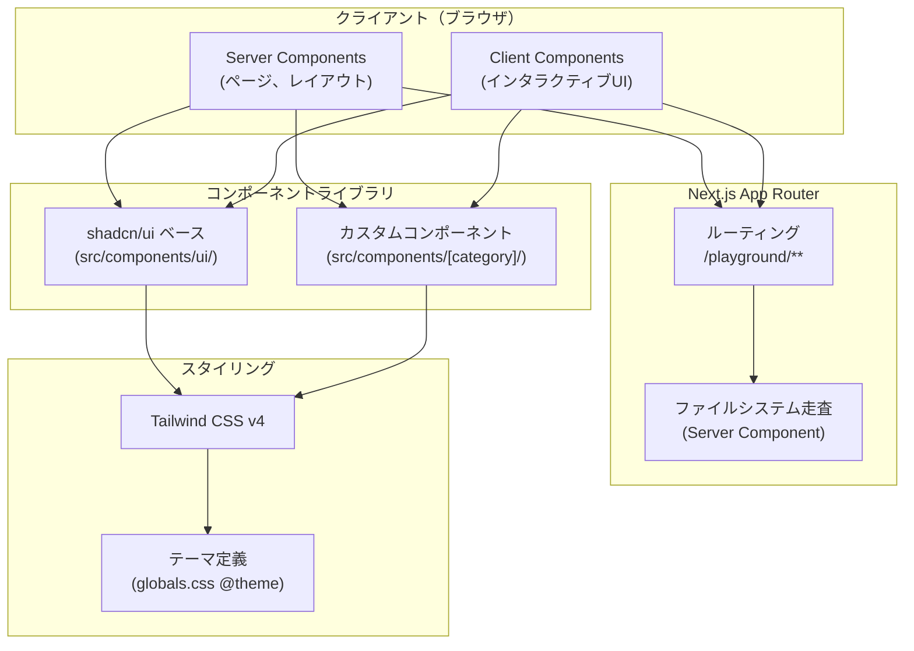

# 技術仕様書

## 1. テクノロジースタック

### コア技術

| 技術 | バージョン | 用途 |
|---|---|---|
| Next.js | 15 | フレームワーク（App Router） |
| React | 19 | UI ライブラリ |
| TypeScript | 5 | 型安全な開発言語 |
| Node.js | v20+ | ランタイム |
| pnpm | v10+ | パッケージマネージャ |

### UI・スタイリング

| 技術 | バージョン | 用途 |
|---|---|---|
| shadcn/ui | 最新 | UI コンポーネントベース（Radix UI プリミティブ） |
| Tailwind CSS | v4 | ユーティリティファースト CSS |
| tailwind-merge | v3 | Tailwind クラスの競合解決 |
| clsx | v2 | 条件付きクラス名結合 |
| class-variance-authority (CVA) | v0.7 | コンポーネントバリアント管理 |
| lucide-react | v0.577 | アイコンライブラリ |

### Radix UI プリミティブ（shadcn/ui 経由）

| パッケージ | 用途 |
|---|---|
| @radix-ui/react-accordion | アコーディオン |
| @radix-ui/react-avatar | アバター |
| @radix-ui/react-collapsible | 折りたたみ |
| @radix-ui/react-dropdown-menu | ドロップダウンメニュー |
| @radix-ui/react-label | フォームラベル |
| @radix-ui/react-scroll-area | スクロール領域 |
| @radix-ui/react-separator | 区切り線 |
| @radix-ui/react-slot | コンポーネント合成 |
| @radix-ui/react-tabs | タブ |

### 将来導入予定

| 技術 | 用途 |
|---|---|
| @dnd-kit/core, @dnd-kit/sortable | ドラッグ&ドロップ・並べ替え |
| motion | アニメーション（旧 framer-motion） |
| Vitest | テストランナー |
| React Testing Library | コンポーネントテスト |
| vitest-axe | アクセシビリティテスト |
| Storybook | コンポーネントカタログ（Next.js プレイグラウンドの補完） |

## 2. 開発ツールと手法

### ビルド・開発サーバー

- **開発サーバー**: `pnpm dev`（Next.js Turbopack 有効）
- **プロダクションビルド**: `pnpm build`（Next.js 標準ビルド）
- **Lint**: `pnpm lint`（ESLint、Next.js 設定ベース）

### MCP（Model Context Protocol）サーバー

shadcn/ui MCP サーバーを開発支援ツールとして活用。

```json
{
  "mcpServers": {
    "shadcn": {
      "command": "/home/tmiyahara/.asdf/shims/npx",
      "args": ["-y", "@anthropic-ai/shadcn-mcp-server"]
    }
  }
}
```

**提供機能**:
- `list_components`: shadcn/ui 全コンポーネント一覧の取得
- `get_component`: 個別コンポーネントのソースコード・props 定義・使用例の取得
- `get_block`: 完成済み UI 構成（ダッシュボード等）の取得

### AI 支援開発

- **Claude Code**: CLI ベースの AI 開発アシスタント（CLAUDE.md による指示）
- **Cursor**: AI 搭載 IDE（`.cursor/rules/project-memory.mdc` による指示）
- ドキュメントは両ツール間で同期（`docs/document-sync-flow.md` 参照）

### バージョン管理

- **Git**: ソースコード管理
- **GitHub**: リモートリポジトリ
- コミットメッセージ規約: `feat|fix|refactor|test|docs|chore(category): 説明`

## 3. アーキテクチャ設計

### 3.1 全体アーキテクチャ



### 3.2 Server Component / Client Component の使い分け

| 種別 | 使用場面 | 例 |
|---|---|---|
| Server Component | 静的表示、ファイルシステム操作、初期データ取得 | プレイグラウンドトップ、ショーケースページ |
| Client Component | 状態管理、イベントハンドラ、ブラウザ API | ComponentBrowser、インタラクティブデモ |

`"use client"` ディレクティブは、状態管理やイベントハンドラが必要な場合にのみ付与する。

### 3.3 コンポーネントの依存関係

```
アプリケーション / デモページ
  └── カスタムコンポーネント (layouts/, navigation/, etc.)
        └── shadcn/ui ベースコンポーネント (ui/)
              ├── Radix UI プリミティブ
              ├── CVA (バリアント管理)
              └── Tailwind CSS v4 (スタイリング)
                    └── テーマ変数 (globals.css @theme)
```

依存の方向は常に上から下へ。下位レイヤーは上位レイヤーに依存しない。

### 3.4 パスエイリアス

```json
{
  "@/*": "./src/*"
}
```

すべてのインポートは `@/` プレフィックスを使用し、相対パスの深いネストを避ける。

## 4. 技術的制約と要件

### 4.1 TypeScript 厳密モード

- `strict: true` を有効化
- `any` の使用を禁止し、不明な型は `unknown` + 型ガードで対処
- すべてのコンポーネント props に型定義を必須とする

### 4.2 shadcn/ui との互換性

- `src/components/ui/` 内のファイルは直接編集しない
- shadcn CLI（`npx shadcn@latest add`）によるアップデートとの衝突を防ぐ
- カスタマイズはラッパーコンポーネントで対応

### 4.3 Tailwind CSS v4 の設定方式

- `tailwind.config.ts` は使用しない
- `src/app/globals.css` 内の `@import "tailwindcss"` + `@theme` ディレクティブで設定
- カラーは OKLCH カラースペースで定義
- `tailwind-merge` v3 系を使用し、v4 のクラス名との互換性を確認

### 4.4 アクセシビリティ要件

- WCAG 2.1 AA レベルを目標
- キーボード操作: Tab, Enter, Space, Escape, Arrow keys
- スクリーンリーダー対応: aria-label, role, aria-expanded 等
- Radix UI プリミティブが提供するアクセシビリティ機能を破壊しない

### 4.5 ブラウザ対応

- Chrome、Firefox、Safari、Edge の各最新版
- デスクトップファーストで設計し、最低限タブレットサイズまでレスポンシブ対応

## 5. パフォーマンス要件

### 5.1 バンドルサイズ

- コンポーネント単位でのインポートを可能にし、未使用コンポーネントがバンドルに含まれないようにする
- Radix UI プリミティブは tree-shakeable な設計

### 5.2 レンダリング最適化

- Server Component を積極的に活用し、クライアントバンドルを最小化
- `"use client"` は必要最小限のコンポーネントにのみ適用
- 将来的に `React.memo` / `useCallback` を適切に使用して不要な再レンダリングを防止

### 5.3 開発サーバー

- Next.js Turbopack による高速な開発サーバー起動・HMR
- ファイル保存後の即座のプレビュー反映

## 6. セキュリティ要件

- XSS 対策: React の自動エスケープに依存しつつ、`dangerouslySetInnerHTML` の使用を避ける
- 入力バリデーション: ユーザー入力を受け取るコンポーネントでは適切なバリデーションを実施
- 依存パッケージの脆弱性: 定期的な `pnpm audit` による確認

## 7. 環境構成

### 7.1 開発環境

| 項目 | 設定 |
|---|---|
| OS | WSL2 (Linux on Windows) |
| Node.js バージョン管理 | asdf |
| パッケージマネージャ | pnpm（`corepack pnpm` でフォールバック） |
| エディタ | Cursor (VSCode ベース) / Claude Code (CLI) |

### 7.2 WSL 環境の注意点

- ファイルウォッチャーの制限（`CHOKIDAR_USEPOLLING=true` が必要な場合あり）
- asdf 管理の Node.js を使用するため、npm/npx はフルパス指定が必要
  - npm: `/home/tmiyahara/.asdf/shims/npm`
  - npx: `/home/tmiyahara/.asdf/shims/npx`
- MCP サーバーのパス設定がホスト・コンテナで異なる場合がある
