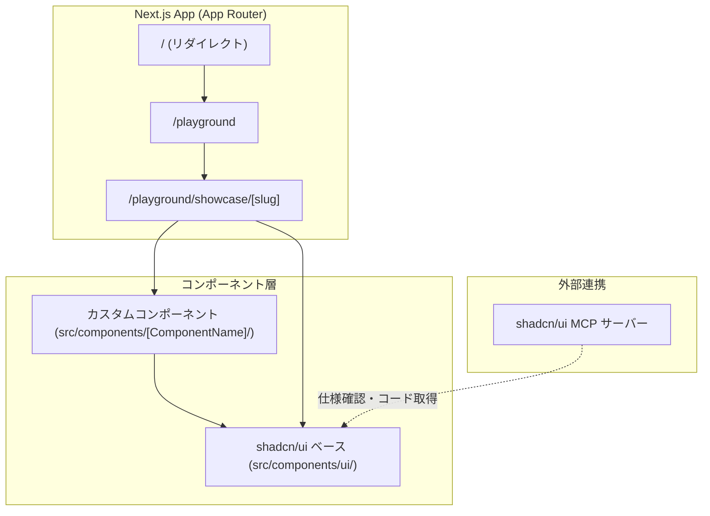
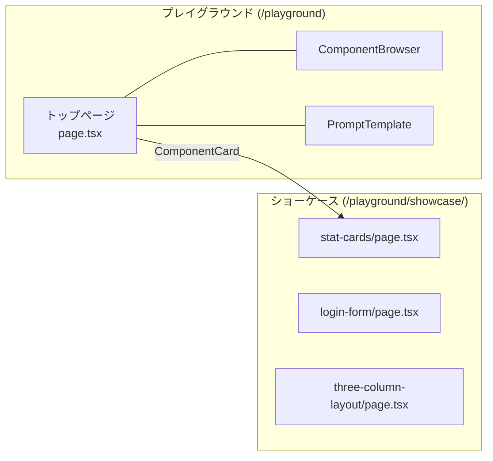
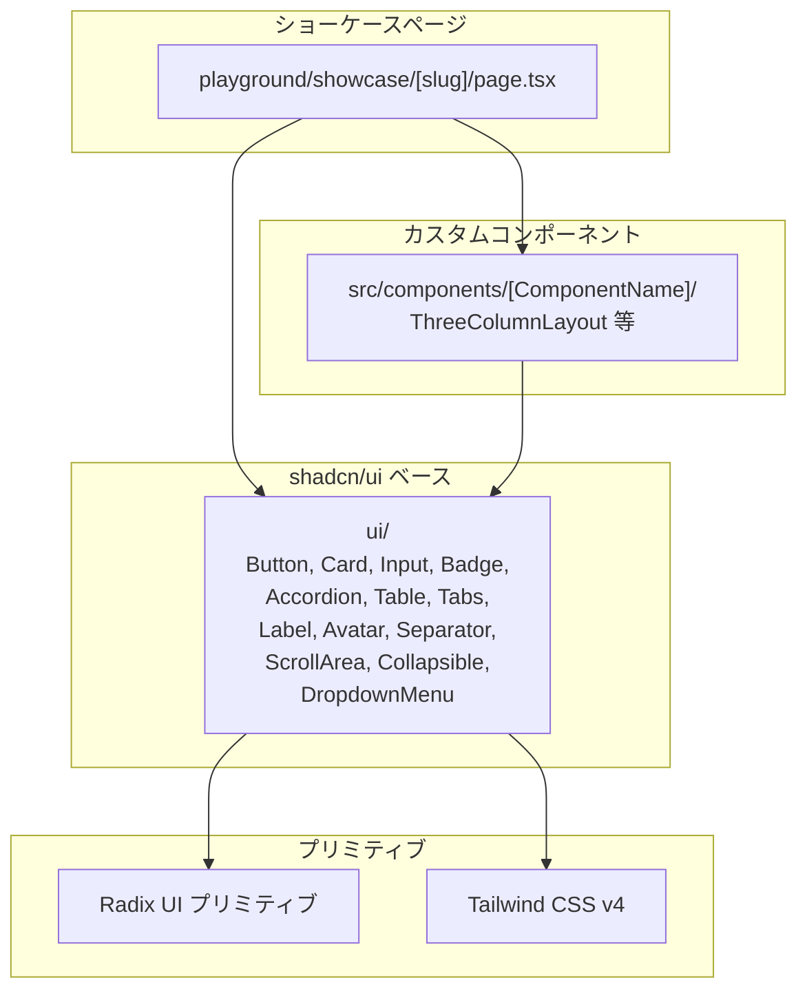
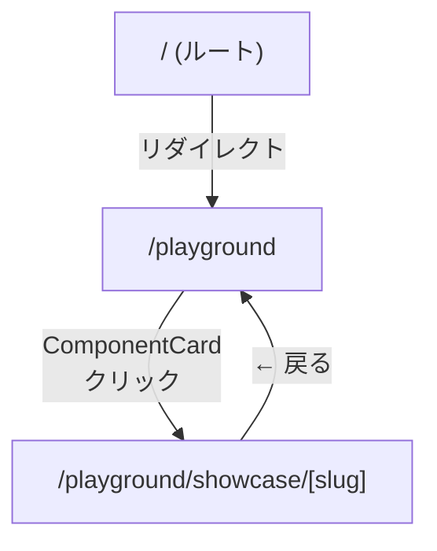

# 機能設計書

## 1. システム全体構成



## 2. 機能アーキテクチャ

### 2.1 プレイグラウンド機能

プレイグラウンドはアプリケーションのメイン機能であり、コンポーネントを組み合わせた実践的な UI パターンの構築・蓄積を目的とする。



#### トップページ（`/playground`）

- **Server Component** としてファイルシステムを走査し、`showcase/` 配下のサブディレクトリを自動検出
- 上部に `ComponentBrowser`（shadcn/ui 全コンポーネント参照）と `PromptTemplate`（コンポーネント設計・実装・レジストリ更新テンプレート）を独立セクションとして配置
- 下部に検出した各ショーケースページを `ComponentCard` コンポーネントでカード一覧として表示
- 各カードには import 文から自動抽出された使用コンポーネント名を Badge で表示

#### ショーケース（`/playground/showcase/[slug]`）

- 複数コンポーネントを組み合わせた実用的な UI パターン
- サンプルデータはファイル内にハードコード（外部データソース不要）
- Claude Code / Cursor によるプロンプト駆動での自動生成を想定
- 2段階プロセス: まず AI にコンポーネント設計を依頼し、設計結果に基づいて実装を指示

### 2.2 ComponentBrowser

shadcn/ui の全コンポーネントを参照できるインタラクティブなブラウザ。

```
┌──────────────────────────────────┐
│  🔍 コンポーネント検索            │
├──────────────────────────────────┤
│  [All] [Form] [Data Display] ... │  ← カテゴリフィルタ
├──────────────────────────────────┤
│  ✅ Button                       │
│     フォーム / ボタン             │
│  ✅ Card                         │
│     データ表示 / カード           │
│  ⬜ Dialog                       │
│     オーバーレイ / ダイアログ     │  ← インストール未のコンポーネント
│  ...                             │
└──────────────────────────────────┘
```

**データソース**: `shadcn-registry.ts`（静的スナップショット、56 コンポーネント収録）

**機能**:
- テキスト検索（名前・説明での絞り込み）
- カテゴリフィルタ（Form, Data Display, Layout, Navigation, Feedback, Overlay, Other）
- インストール状態の表示（`src/components/ui/` との照合）

### 2.3 PromptTemplate

コンポーネント設計・実装のプロンプトテンプレートを提供する独立セクション。ComponentBrowser の下に配置。

**機能**:
- 3つのタブで切り替え:
  - **コンポーネント設計**: UI イメージからコンポーネント分割・責務・Props を設計させるプロンプト
  - **実装**: 設計結果に基づいてコンポーネントとショーケースページを生成するプロンプト
  - **レジストリ更新**: shadcn-registry.ts の更新プロンプト
- クリップボードへのコピー

### 2.4 コンポーネントレイヤー構造



カスタムコンポーネントは必ず `ui/` のベースコンポーネントを基盤として構築する。`ui/` 内のファイルは直接編集せず、拡張が必要な場合は `src/components/[ComponentName]/` にラッパーコンポーネントを作成する。コンポーネントディレクトリはフラット構成で、カテゴリ別のサブディレクトリは使用しない。

## 3. データモデル

### 3.1 shadcn/ui コンポーネントレジストリ

```typescript
interface ShadcnComponent {
  name: string;           // 表示名（例: "Button"）
  slug: string;           // 識別子（例: "button"）
  description: string;    // コンポーネントの説明
  category: ShadcnCategory; // 分類カテゴリ
  docsUrl: string;        // shadcn/ui ドキュメント URL
  installed: boolean;     // インストール済みフラグ
}

type ShadcnCategory =
  | "Form"
  | "Data Display"
  | "Layout"
  | "Navigation"
  | "Feedback"
  | "Overlay"
  | "Other";
```

### 3.2 プレイグラウンドのページ検出

プレイグラウンドのトップページは、ファイルシステムを走査して動的にページ一覧を構築する。

```
playground/showcase/ → fs.readdirSync → ショーケース一覧
```

各ディレクトリ名がスラッグとして使用され、表示名はディレクトリ名から自動生成される（kebab-case → Title Case）。各ページの import 文を解析し、使用している `@/components/` 配下のコンポーネント名を自動抽出して `PlaygroundEntry.usedComponents` に格納する。

### 3.3 カスタムコンポーネントの型定義パターン

```typescript
// 例: ThreeColumnLayout の型定義
interface NavItem {
  id: string;
  label: string;
  icon?: React.ReactNode;
  isActive?: boolean;
}

interface ListItem {
  id: string;
  title: string;
  subtitle?: string;
  avatar?: string;
  timestamp?: string;
}

interface ThreeColumnLayoutProps {
  navItems?: NavItem[];
  listItems?: ListItem[];
  onNavItemClick?: (item: NavItem) => void;
  onListItemClick?: (item: ListItem) => void;
  children?: React.ReactNode;
}
```

## 4. 画面遷移図



- すべてのページはプレイグラウンドレイアウト（`playground/layout.tsx`）でラップされ、共通ヘッダーとナビゲーションを提供
- ルート（`/`）アクセス時は自動的に `/playground` へリダイレクト

## 5. コンポーネント設計パターン

### 5.1 合成パターン（Composition）

```tsx
// shadcn/ui の設計思想に従い、小さなパーツの組み合わせで構成
<Card>
  <CardHeader>
    <CardTitle>タイトル</CardTitle>
    <CardDescription>説明</CardDescription>
  </CardHeader>
  <CardContent>
    {/* コンテンツ */}
  </CardContent>
</Card>
```

### 5.2 Controlled Component パターン

```tsx
// 親コンポーネントが状態を管理し、コールバックで変更を通知
<ThreeColumnLayout
  navItems={navItems}
  listItems={listItems}
  onNavItemClick={(item) => setActiveNav(item.id)}
  onListItemClick={(item) => setSelectedItem(item)}
>
  <DetailContent item={selectedItem} />
</ThreeColumnLayout>
```

### 5.3 デフォルト表示パターン

すべてのカスタムコンポーネントは、必須 props なしでもデフォルト表示できるように設計する。

```tsx
// props が未指定でもフォールバック値で表示される
<ThreeColumnLayout />  // デフォルトのナビゲーション・リストで表示
```

## 6. スタイリングシステム

### 6.1 テーマカラー（OKLCH カラースペース）

```
背景系:    background, card, popover
テキスト系: foreground, card-foreground, popover-foreground
アクセント: primary, secondary, accent, destructive
ユーティ:  muted, border, input, ring
```

ライトモード（`:root`）とダークモード（`.dark`）の両方のカラーセットを定義。

### 6.2 クラス名の結合

```typescript
import { cn } from "@/lib/utils";

// clsx + tailwind-merge で競合するクラスを安全にマージ
cn("px-4 py-2", isActive && "bg-primary text-primary-foreground")
```

## 7. 将来の拡張ポイント

| 機能 | 現状 | 将来計画 |
|---|---|---|
| コンポーネントプレビュー | Next.js ページ | Storybook 導入 |
| テスト | 未導入 | Vitest + React Testing Library + vitest-axe |
| 状態管理 | useState / props | 必要時に React Context / Zustand 導入 |
| ドラッグ&ドロップ | 未導入 | @dnd-kit/core, @dnd-kit/sortable |
| アニメーション | 未導入 | motion（旧 framer-motion） |
| CI/CD | 未導入 | GitHub Actions（ビルド・リント・テスト） |
